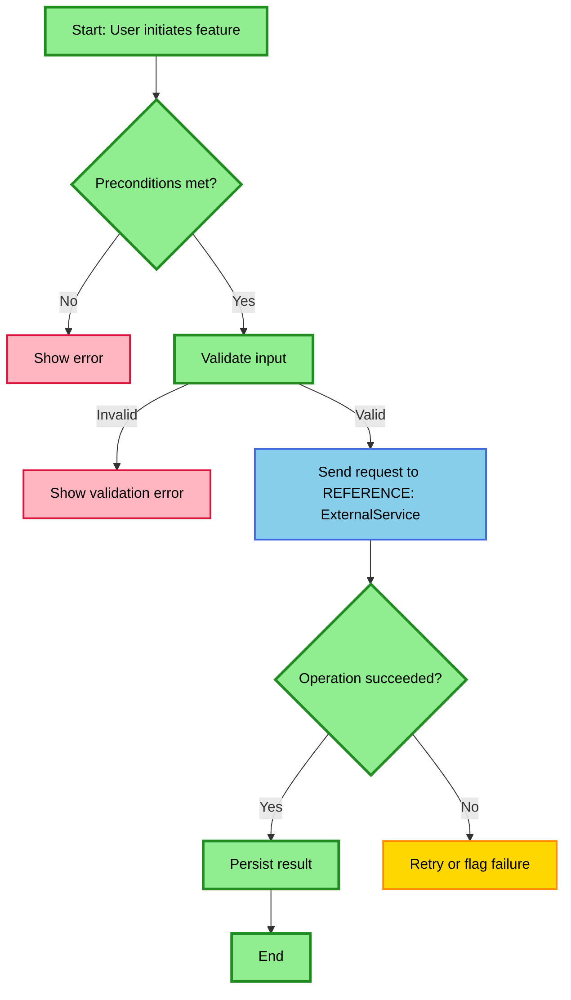
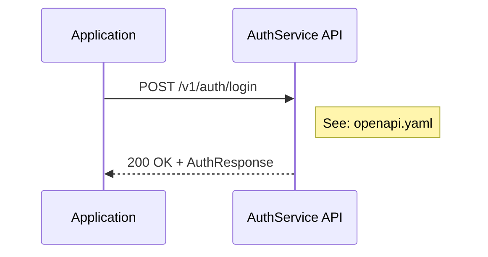
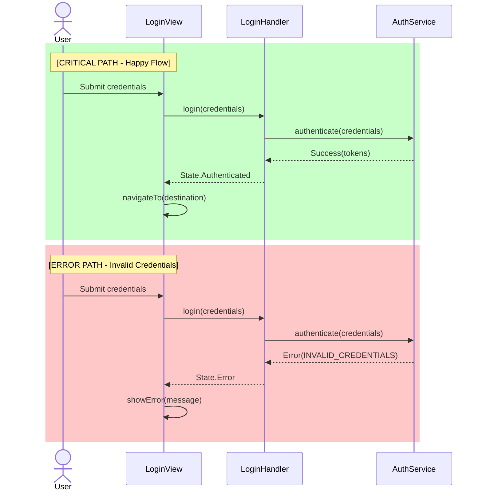

> **⚠️ Schema:** This command follows `.claude/command-schema.md`. Read schema before modifying. If not found, ask user.

# Feature Documentation Generator

> Produces three complementary deliverables for a given feature: a full BDD specification, a business-focused Mermaid flowchart, and a technical Mermaid sequence diagram based on the feature's description and codebase behavior.

## Purpose

This command analyzes source code evidence files and produces comprehensive documentation that captures both business behavior and technical implementation of a feature.

**Use when:**
- Documenting a new or existing feature for QA, product design, or reimplementation
- Creating specifications that bridge business requirements and technical implementation
- Generating visual documentation of complex feature workflows
- Establishing a complete behavioral blueprint for a feature

**Do not use when:**
- You need only a quick summary (use simpler documentation approaches)
- The feature is trivial and doesn't warrant three-document analysis

## Key Principles

**Transaction Completeness:**
Documentation captures the entire user transaction from initial action to application quiescence (idle state), not just the code within evidence files. The feature is not complete until the application reaches idle state with no pending operations and the user sees the final result.

- **Anti-Pattern:** "Login feature ends when LoginViewController calls completion"
- **Correct:** "Login feature ends when user sees main screen and app is idle"

**Bidirectional Tracing:**
Trace code paths in BOTH directions:
- **Forward:** What happens after the feature completes (callbacks, navigation, state changes)
- **Backward:** What can invoke this feature and with what parameters/state

Features may behave differently based on entry context (e.g., Login screen showing "account blocked" toast when entered after forbidden auth state).

**1:1 Correspondence:**
Maintain strict correspondence between documents:
- Between BDD scenarios and flowchart branches (business perspective)
- Between BDD scenarios and sequence diagram flows (technical perspective)
- Between flowchart business actions and sequence diagram technical implementations

**Source Code as Truth:**
If contradictions are found during validation, always defer to the source code as the authoritative source. Documentation must match implementation.

## Inputs

**Expects:** JSON object with feature metadata
**Required:** Yes

### JSON Schema

```json
{
  "feature_name": "Feature Name",
  "category": "Category",
  "surface": ["Screen", "Component"],
  "actors": ["Guest", "EndUser"],
  "flags_or_flavors": [],
  "evidence": [                              // OPTIONAL - will be discovered if not provided
    "relative/path/to/file1.kt",
    "relative/path/to/file2.xml:SpecificClass"
  ],
  "description": "Business-level description of the feature"
}
```

### Parameter Definitions

| Parameter | Required | Type | Description |
|-----------|----------|------|-------------|
| `feature_name` | Yes | string | Name of the feature (converted to lowercase with hyphens for folder/file names) |
| `category` | Yes | string | Business category (e.g., "Acquisition", "Retention", "Monetization") |
| `surface` | Yes | array | UI surface types where feature appears (e.g., "Screen", "Dialog", "Component", "Widget") |
| `actors` | Yes | array | User roles interacting with the feature (e.g., "Guest", "EndUser", "Admin", "Performer") |
| `flags_or_flavors` | No | array | Feature flags or build flavors that control this feature (empty if always enabled) |
| `evidence` | No | array | File paths pointing to source code implementing the feature (if not provided, will be discovered based on feature_name and description) |
| `description` | Yes | string | Concise business-level description of what the feature does and its purpose |

### Evidence Path Format

Evidence paths support multiple formats:
- Simple path: `path/to/file.ext`
- Path with class reference: `path/to/file.ext:ClassName`
- Path with method reference: `path/to/file.ext:ClassName.methodName`

### Usage

```
/feature-documentation {"feature_name": "User Login", "category": "Authentication", "surface": ["Screen"], "actors": ["Guest"], "flags_or_flavors": [], "evidence": ["src/features/auth/LoginScreen.tsx"], "description": "Email and password authentication flow"}
```

## Prerequisites

### Gate 1: Evidence Available or Discoverable

**Check:** Evidence files are provided OR feature can be discovered from codebase
**Pass:** Proceed to Gate 2
**Fail:** Exit only if discovery yields no results

**If evidence provided:**
- Verify at least one evidence file path can be resolved
- Mark unresolvable paths as `[MISSING EVIDENCE: path]`
- Continue with available files

**If evidence not provided:**
- Proceed to Step 2 for autonomous evidence discovery

### Gate 1.5: Variant Implementation Verification

**Check:** If ANY evidence filename contains variant indicators (`Default`, `Base`, `Standard`, `Main`, `Common`, `Impl`), variant search has been performed
**Pass:** All variant implementations documented in evidence list, proceed to Gate 2
**Fail:** Return to Step 2 and complete variant discovery

**Fail Recovery Procedure:**
1. Extract base name from indicator-containing filename (e.g., `LoginUseCaseDefault` → `LoginUseCase`)
2. Search for sibling classes matching base name pattern
3. Search dependency injection / factory modules for Provider patterns referencing the base type
4. Add all discovered variants to evidence list
5. Document the selection mechanism (build-time flavor, runtime configuration, DI module)
6. Re-validate this gate

**Verification Questions (must answer ALL):**

| Question | Required Answer |
|----------|-----------------|
| Does any evidence filename contain variant indicators? | Yes (list them) or No |
| If yes, what is the base name? | [Must name extracted base] |
| What sibling implementations exist? | [Must list all or state "None found" with search evidence] |
| What determines variant selection? | [Must identify mechanism: DI module, build flavor, runtime config] |

### Gate 2: Mermaid CLI Available

**Check:** Project has Mermaid CLI installed (`npx mmdc --version` succeeds)
**Pass:** Proceed to Process
**Fail:** Warn user but continue (syntax validation will be skipped)

## Process

### Step 1: Parse JSON Input

Extract feature metadata from the JSON input:
1. Parse the JSON object
2. Extract `feature_name` and convert to kebab-case for folder/file naming
3. Store all metadata for use in output generation

### Step 2: Resolve or Discover Evidence Files

#### Case A: Evidence Provided

For each evidence entry:

**Substep 2.1: Parse Evidence Path**
- Extract file path and optional class/method reference (after `:`)
- Example: `SplashActivity.kt:SplashActivity` → file: `SplashActivity.kt`, focus: `SplashActivity` class

**Substep 2.2: Locate Files**
**Priority order:**
1. Try resolving as absolute path
2. Try relative to current working directory
3. Use Glob tool to search for filename in project
4. Check paths relative to git repository root

**If file not found:**
- Mark as `[MISSING EVIDENCE: path]`
- Continue with available files

**Substep 2.3: Extract Class/Method Context**
- If reference provided (after `:`), focus analysis on that specific component
- Example: `AndroidManifest.xml:SplashActivity` → focus on SplashActivity configuration

#### Case B: Evidence Not Provided (Autonomous Discovery)

When evidence array is empty or not provided, discover relevant source files:

**Substep 2.4: Search by Feature Name**
- Convert feature_name to search patterns (e.g., "User Login" → `*Login*`, `*login*`, `*user-login*`)
- Search for source files matching the pattern, excluding:
  - Dependency directories (`node_modules`, `vendor`, `Pods`, `.gradle`, `packages`)
  - Build outputs (`dist`, `build`, `out`, `target`, `.next`, `__pycache__`)
  - Version control (`.git`, `.svn`)
  - Assets and media files (images, fonts, videos)
- Prioritize files with common source code extensions for the detected project type
- Filter results by reading file headers to confirm source code (not assets, configs, or generated files)

**Substep 2.5: Search by Surface Type**
- Use surface hints to identify architectural layer:

  | Surface Category | Includes | Common Patterns |
  |------------------|----------|-----------------|
  | Presentation | Screen, Page, Dialog, Modal, Component, Widget | `*Screen*`, `*Page*`, `*View*`, `*Dialog*`, `*Modal*`, `*Component*` |
  | API/Endpoint | Endpoint, Route, Controller, Handler | `*Controller*`, `*Handler*`, `*Router*`, `*Route*`, `*Resource*` |
  | Service/Logic | Service, UseCase, Interactor, Manager | `*Service*`, `*UseCase*`, `*Interactor*`, `*Repository*`, `*Manager*` |
  | Data | Repository, Store, Cache, Model | `*Repository*`, `*Store*`, `*Model*`, `*Entity*`, `*DAO*` |

- Patterns are illustrative; adapt to project naming conventions

**Substep 2.6: Search by Description Keywords**
- Extract key terms from description
- Use Grep to find files containing those terms
- Prioritize files with multiple keyword matches

**Substep 2.7: Validate Discovered Files**
- Read candidate files to confirm relevance
- Filter out test files, mocks, and unrelated matches
- Rank by relevance based on:
  - Feature name match strength
  - Surface type alignment
  - Description keyword density
- Select top candidates as evidence files

**Substep 2.8: Variant Implementation Discovery**

Evidence files may represent one of several parallel implementations. Search for variants when indicators are present.

**Indicators:**
- File or class name contains qualifiers: `Default`, `Base`, `Standard`, `Main`, `Common`, `Impl`
- Class inherits from abstract base or implements interface/protocol
- Project structure contains parallel source directories for build variants
- Dependency injection or factory patterns reference multiple concrete types

**When indicators detected:**
- Search for sibling implementations sharing the same base name or parent type
- Examine build configuration and DI modules to identify all variants
- Add all discovered variant files to evidence list
- Document the selection mechanism (build-time, runtime, configuration)

**Rationale:** A feature documented from only one variant will miss conditional behavior present in other variants.

**If no files discovered:**
- Report `[DISCOVERY FAILED: No matching source files found for "${feature_name}"]`
- Exit with suggestions for manual evidence specification

### Step 3: Analyze Source Code

Read all resolved evidence files and identify:
- Dependencies (imports, service calls, repository usage)
- Business logic and validation rules
- State transitions and navigation flows
- Error handling patterns
- External service integrations

### Step 4: Expand Analysis with Transaction Tracing

Evidence files are the **starting point**, not the boundary. Treat the feature as an atomic transaction from user initiation to system quiescence.

#### Substep 4.1: Forward Tracing
Trace what happens after feature code executes:
- Direct method calls within evidence files
- Indirect callbacks, delegates, and observers
- Navigation/routing logic that redirects control flow
- Background tasks, async operations, and delayed executions
- State changes propagated through stores, repositories, or event buses
- Lifecycle events triggered in parent/coordinator components

#### Substep 4.1b: Parent Coordinator Tracing (MANDATORY)

**CRITICAL:** Feature completion is NOT the transaction end. You MUST trace what the PARENT coordinator/flow does after receiving the completion callback.

**Discover invocations by searching for common patterns:**

| Paradigm | Invocation Patterns to Search |
|----------|-------------------------------|
| Navigation/Routing | `navigate(${FEATURE})`, `router.push(${FEATURE})`, `goto ${FEATURE}`, `redirect(${FEATURE})` |
| Instantiation | `new ${FEATURE}()`, `${FEATURE}.create()`, `${FEATURE}Factory`, `build${FEATURE}()` |
| Event-Driven | `dispatch(${FEATURE}Action)`, `emit('${FEATURE}')`, `publish(${FEATURE}Event)`, `send(${FEATURE}Command)` |
| Dependency Injection | `provide(${FEATURE})`, `inject(${FEATURE})`, `resolve(${FEATURE})`, `${FEATURE}Provider` |
| Function Call | `start${FEATURE}()`, `open${FEATURE}()`, `show${FEATURE}()`, `handle${FEATURE}()` |

**Examine each caller to understand:**
1. What parameters/state are passed to the feature
2. What the caller does when the feature completes
3. Any conditional logic before or after invocation

**You MUST identify and document:**
1. **Parent orchestrator name** — the component that invokes this feature (e.g., `AppRouter`, `MainController`, `RootCoordinator`, `Shell`, `RequestHandler`)
2. **What parent does after feature completion:**
   - Conditional navigation (state-dependent routing)
   - Deferred operations (queued actions executed post-completion)
   - State machine transitions
   - Analytics or tracking events
3. **Any conditional post-completion logic** based on:
   - User state or session data
   - Feature flags or configuration
   - Pending operations queued before this feature started

**Example pattern to trace:**
```
${FEATURE_NAME}Flow.completion called
  ↓
ParentFlow receives completion
  ↓
ParentFlow checks [CONDITION A] → [DOCUMENT IF BRANCHES]
  ↓
ParentFlow checks [CONDITION B] → [DOCUMENT IF BRANCHES]
  ↓
ParentFlow starts NextFlow
  ↓
User sees destination screen [ACTUAL IDLE STATE]
```

**Anti-pattern (WRONG):**
```
${FEATURE_NAME}Flow.completion called → [STOP HERE - INCOMPLETE!]
```

#### Substep 4.2: Backward Tracing

Identify all entry points into this feature:

**Discover:**
- All callers that invoke, instantiate, or route to this feature
- Import or dependency statements that reference this feature
- Route definitions, navigation mappings, or URL patterns targeting this feature

**For each caller, analyze:**
- Parameters, props, or state passed to the feature
- Pre-invocation actions (notifications, analytics, permission checks, state preparation)
- Post-invocation handling (callbacks, subscriptions, navigation on completion)
- Whether different callers provide different contexts that affect feature behavior

**Entry Point Documentation Format:**

For each entry point discovered, capture in structured format:

| Field | Required | Description |
|-------|----------|-------------|
| Caller | Yes | Specific class and method that invokes this feature |
| Condition | Yes | What triggers this entry path (user action, system event, state) |
| Parameters | Yes | All parameters passed, with types and possible values |
| Pre-display Actions | If any | Operations performed BEFORE feature UI is shown |
| Post-display Actions | If any | Operations performed AFTER feature UI is shown |
| Context Effects | If any | How this entry context changes feature behavior |

This structured format must be used when documenting entry points in the BDD specification.

#### Substep 4.3: External UI Trigger Tracing

Identify external code that triggers UI elements associated with this feature:
- Toasts, snackbars, or notifications shown before/after feature display
- Conditional UI elements based on feature state or entry context
- Deep link or URL handlers that route to this feature

#### Substep 4.4: Determine Idle State
Continue tracing until reaching idle state conditions:
- No pending asynchronous operations (promises, futures, callbacks, background tasks, scheduled jobs)
- Navigation/routing has settled (final view/page/screen rendered to user)
- All data persistence complete (database writes, cache updates, secure storage, session state, user preferences)
- All network requests completed and responses processed
- All UI updates rendered and animations/transitions finished
- Application returns to awaiting user input or external event

**Discovery Techniques:**
- **Completion handlers:** Trace what happens after feature-specific code completes
- **Navigation flows:** Follow scene/activity transitions until final destination
- **State observers:** Track reactive state changes across app layers
- **Lifecycle callbacks:** Examine parent component lifecycle methods
- **Deferred operations:** Check for scheduled work, timers, or background jobs

#### Substep 4.5: Checkpoint — Transaction Completeness

> **GATE:** Do not proceed to Step 5 until ALL items are verified.

**Required Checklist:**

- [ ] **Parent coordinator identified:** Named the specific class that STARTS this feature
- [ ] **Parent's completion handler read:** Examined the actual code that executes when this feature's completion callback fires
- [ ] **Post-completion actions documented:** Listed ALL conditional branches and actions the parent takes after this feature completes
- [ ] **True idle state verified:** Confirmed the FINAL screen user sees (not intermediate navigation)
- [ ] **Cross-cutting concerns captured:** Documented any behaviors triggered by parent that affect user experience
- [ ] **Variant implementations verified:** If any evidence filename contains variant indicators (Default, Base, Standard, Main, Common, Impl), all sibling implementations identified and added to evidence

**Verification Questions (must answer ALL):**

| Question | Your Answer |
|----------|-------------|
| What class STARTS this feature? | [Must name specific class, not "unknown"] |
| What does parent do on completion? | [Must describe actual code behavior] |
| Any conditional post-completion flows? | [Must verify YES with details, or NO with evidence] |
| What screen does user ACTUALLY see? | [Must name final destination screen] |
| Any evidence files contain variant indicators? | [Must answer YES with list, or NO] |
| If YES, all variants discovered and documented? | [Must confirm variants added to evidence or state "No siblings found" with search evidence] |

**If not satisfied:** Return to Substep 4.1b and trace parent coordinator

**Example of PASSING:**
```
✓ Parent: ParentFlow (ParentFlow.swift:45)
✓ Completion handler: handle${FEATURE_NAME}Completion() line 234
✓ Post-completion: conditionalCheck (240), stateTransition (248), else NextFlow (255)
✓ Final screen: DestinationViewController
✓ Cross-cutting: [List any behaviors triggered by parent, not by this feature directly]
```

**Example of FAILING:**
```
✗ Parent: "${FEATURE_NAME}Flow itself" → WRONG: Must trace to PARENT
✗ Completion: "Not examined" → WRONG: Must read actual code
✗ Post-completion: "Feature just completes" → WRONG: Must verify parent's actions
```

### Step 5: Create BDD Specification

**Action:** Create folder `${FEATURE_NAME}/` and write `${FEATURE_NAME}.bdd.md` immediately.

Generate `${FEATURE_NAME}/${FEATURE_NAME}.bdd.md` with:

#### Content Structure:
```markdown
# BDD Specification: ${FEATURE_NAME}

> **Location:** `${FEATURE_NAME}/${FEATURE_NAME}.bdd.md`

## Metadata
- **Category:** ${CATEGORY}
- **Surface:** ${SURFACE} (e.g., Screen, Dialog, Component)
- **Actors:** ${ACTORS} (e.g., Guest, EndUser, Admin)
- **Feature Flags/Flavors:**
  - `flagName` - Effect on feature behavior when enabled/disabled
  - `anotherFlag` - What this flag controls
  - (or "None - Always enabled" if no conditional behavior)
- **Variant Implementations:** (if applicable)
  - `VariantA` - Used when [condition]
  - `VariantB` - Used when [condition]
  - **Selection Mechanism:** [DI module / build flavor / runtime config]
- **Evidence Files:**
  - `path/to/file1.kt`
  - `path/to/file2.xml:ClassName`

## Overview
${DESCRIPTION}

## Entry Points

### Entry Point 1: [Context Name]
- **Caller:** `ClassName.methodName()`
- **Condition:** What triggers this entry path
- **Parameters:** List all parameters with types
- **Pre-display Actions:** Operations before feature UI shown (if any)
- **Context Effects:** How this context affects feature behavior (if any)

### Entry Point 2: [Context Name]
...

## Business Rules

### BR-001: [Rule Name]
- **Rule:** [Precise description with specific values/thresholds]
- **Applies to:** [Which scenarios/conditions]

### BR-002: [Rule Name]
...

## Scenarios
### Scenario 1: ...
Given ...
When ...
Then ...

### Scenario 2: ...
...
```

#### BDD Requirements:
- Document ALL user roles, permissions, validations, and preconditions
- Capture every main path, alternate path, and error/edge case
- Include limits, retries, rate limits, and timeouts
- Mark external dependencies as `[REFERENCE: ServiceName]` or `[MISSING LINK]`
- Document complete user transaction from initiation to idle state
- Include cross-cutting concerns discovered during transaction tracing
- Create scenario for each unique entry context that affects user experience
- Each scenario must be exhaustive and business-readable
- Extract and document all business rules with unique identifiers (BR-001, BR-002, etc.)
- Business rules include: validation thresholds, selection logic, state machine transitions, conditional behaviors, rate limits, retry policies
- Each rule must include specific values, not generic descriptions (e.g., "password minimum 8 characters" not "password must meet requirements")
- **Compound Condition Extraction:** For conditional behaviors (feature triggers, navigation decisions, UI state changes), extract the COMPLETE boolean expression from source code. Do not paraphrase or simplify.

  Anti-pattern (incomplete):
  ```
  Rule: Feature X is shown when the user is eligible and the feature is enabled
  ```

  Correct pattern (complete):
  ```
  Rule: Feature X is shown when ALL conditions are true:
    (1) userType != TYPE_A
    (2) featureFlag.isEnabled == true
    (3) user.status == ACTIVE
  ```

  Extraction method: Locate the `if`/`when`/`guard` statement controlling the behavior and transcribe each sub-condition verbatim with its comparison operator and value.
- Document system-triggered behaviors: UI state changes from system events (keyboard visibility, orientation, network status), lifecycle callbacks, and timer-based operations

### Step 6: Create Business Flowchart

**Action:** Write `${FEATURE_NAME}/${FEATURE_NAME}.flowchart.mmd` immediately.

Generate `${FEATURE_NAME}/${FEATURE_NAME}.flowchart.mmd` with:

#### Syntax Requirements:
- Use `flowchart TD` (top-down layout)
- Follow official Mermaid syntax: https://docs.mermaidchart.com/mermaid-oss/syntax/flowchart.html

#### Content Requirements:
- Represent every scenario and condition from BDD
- Include all decision points (`{condition}` nodes)
- Show all success, alternate, and failure paths
- Represent forks and joins as `((Fork))` and `((Join))`
- Include business states or milestones
- Mark external dependencies as `[REFERENCE: ServiceName]`
- Model preconditions, validations, and permission checks
- Show external calls or async processes
- Include retry and fallback logic
- Capture all granular business behavior

#### Exclusions (Technical Details):
- Do NOT include internal variable setting or parameter assignments
- Do NOT break down API request construction into individual steps
- Focus on WHAT happens from business perspective, not HOW

#### Color Coding:
Apply styles using `:::className` syntax after node definitions.

**IMPORTANT:** Apply colors to ALL nodes on the critical path, including decision boxes, to create an unbroken visual flow.



**Color Scheme:**
| Class | Color | Usage |
|-------|-------|-------|
| `criticalPath` | Green (#90EE90) | Main happy path nodes AND decision boxes on critical path |
| `errorPath` | Red (#FFB6C1) | Error handling, failure nodes, decision boxes leading to errors |
| `alternatePath` | Yellow (#FFD700) | Alternate valid paths (not errors, not main flow) |
| `externalCall` | Blue (#87CEEB) | External service dependencies |

### Step 7: Create Technical Sequence Diagram

**Action:** Write `${FEATURE_NAME}/${FEATURE_NAME}.sequence.mmd` immediately.

Generate `${FEATURE_NAME}/${FEATURE_NAME}.sequence.mmd` with:

#### Syntax Requirements:
- Start with `sequenceDiagram` keyword (no spaces, no hyphens)
- Follow official Mermaid syntax: https://docs.mermaidchart.com/mermaid-oss/syntax/sequenceDiagram.html

#### Content Requirements:
- Show ALL technical implementation details
- Include all actors, components, classes, and services
- Document every method call in execution flow
- Show parameter passing and data transformations
- Include API requests/responses with full technical details (see API Documentation Requirements below)
- Document database operations
- Show state changes and variable assignments
- Include internal validations and checks
- Document exception handling and error propagation
- Show callbacks, listeners, and async operations
- Include threading details (main thread, background threads, coroutines)
- Document lifecycle events

#### Architecture Layer Completeness:

The sequence diagram must show ALL architectural layers involved in data flow, not just entry and exit points.

**Required layers to identify and include (when present):**
- Presentation layer (Views, Activities, ViewControllers, Components)
- Domain layer (UseCases, Interactors, Services)
- Data layer (Repositories, DataStores, DAOs)
- Network layer (API clients, CloudDataStores, HTTP services)
- Persistence layer (Local storage, Caches, Databases)

**Anti-pattern (incomplete):**
```
Repository->>API: request()
```

**Correct pattern:**
```
Repository->>DataStore: getData()
DataStore->>APIClient: request()
APIClient->>HTTPService: execute()
```

If intermediate layers exist between a caller and an external service, they must appear as separate participants.

#### API Documentation Requirements:

Every API call in the sequence diagram MUST include sufficient detail for complete reimplementation. API documentation follows the **OpenAPI 3.1 Specification** (https://swagger.io/specification/).

**Required API Details (OpenAPI-aligned):**

| OpenAPI Element | Description | Example |
|-----------------|-------------|---------|
| `servers[].url` | Base URL / domain | `https://api.example.com` |
| `paths.{path}` | Endpoint path with path parameters | `/v1/auth/login`, `/users/{userId}` |
| `paths.{path}.{method}` | HTTP operation | `post`, `get`, `put`, `delete` |
| `parameters` | Path, query, header, cookie params | `in: header, name: Authorization` |
| `requestBody.content` | Request body schema by media type | `application/json: {schema: ...}` |
| `responses.{code}` | Response schemas by status code | `200: {content: ...}`, `401: {content: ...}` |
| `security` | Authentication requirements | `bearerAuth: []` |

**API Documentation Format in Sequence Diagram:**

API calls in the sequence diagram should reference the OpenAPI specification file using `operationId`. Do NOT duplicate API details inline—the OpenAPI file is the single source of truth.



**Reference Format:** `See: openapi.yaml#{operationId}`

This approach:
- Maintains single source of truth in OpenAPI file
- Keeps sequence diagrams readable and focused on flow
- Enables API changes without updating diagrams
- Allows code generation from authoritative OpenAPI spec

**Companion OpenAPI Specification File (Required for features with API calls)**

Create a companion file `${FEATURE_NAME}/${FEATURE_NAME}.openapi.yaml` following OpenAPI 3.1 specification:

```yaml
openapi: 3.1.0
info:
  title: ${FEATURE_NAME} API
  description: API endpoints for the ${FEATURE_NAME} feature
  version: 1.0.0

servers:
  - url: https://api-gw.production-domain.com
    description: Production API Gateway
  - url: https://api-gw.staging-domain.com
    description: Staging environment (if applicable)
  # List ALL actual production domains used by this feature
  # Do NOT use placeholder domains like example.com

paths:
  /v1/auth/login:
    post:
      operationId: loginUser
      summary: Authenticate user with email and password
      tags:
        - Authentication
      parameters:
        - name: X-Client-Version
          in: header
          required: true
          schema:
            type: string
          description: Application version string
        - name: X-Device-ID
          in: header
          required: false
          schema:
            type: string
          description: Unique device identifier
      requestBody:
        required: true
        content:
          application/json:
            schema:
              $ref: '#/components/schemas/LoginRequest'
      responses:
        '200':
          description: Successful authentication
          content:
            application/json:
              schema:
                $ref: '#/components/schemas/AuthResponse'
        '400':
          description: Validation error
          content:
            application/json:
              schema:
                $ref: '#/components/schemas/ErrorResponse'
        '401':
          description: Invalid credentials
          content:
            application/json:
              schema:
                $ref: '#/components/schemas/ErrorResponse'
        '403':
          description: Account locked
          content:
            application/json:
              schema:
                $ref: '#/components/schemas/ErrorResponse'
        '429':
          description: Rate limited
          content:
            application/json:
              schema:
                $ref: '#/components/schemas/ErrorResponse'
              example:
                error: rate_limited
                message: Too many login attempts
                details:
                  retry_after: 60
      security: []  # Public endpoint

components:
  schemas:
    LoginRequest:
      type: object
      required:
        - email
        - password
      properties:
        email:
          type: string
          format: email
          description: User email address
        password:
          type: string
          minLength: 8
          description: User password
        remember_me:
          type: boolean
          default: false
          description: Extend token lifetime

    AuthResponse:
      type: object
      required:
        - access_token
        - refresh_token
        - expires_in
        - token_type
        - user
      properties:
        access_token:
          type: string
          description: JWT access token
        refresh_token:
          type: string
          description: Refresh token for token renewal
        expires_in:
          type: integer
          description: Seconds until access_token expires
        token_type:
          type: string
          enum: [Bearer]
        user:
          $ref: '#/components/schemas/User'

    User:
      type: object
      required:
        - id
        - email
        - display_name
      properties:
        id:
          type: string
          format: uuid
          description: User UUID
        email:
          type: string
          format: email
        display_name:
          type: string
        avatar_url:
          type: string
          format: uri
          nullable: true

    ErrorResponse:
      type: object
      required:
        - error
        - message
      properties:
        error:
          type: string
          enum:
            - validation_error
            - invalid_credentials
            - account_locked
            - rate_limited
        message:
          type: string
          description: Human-readable error message
        details:
          type: object
          nullable: true
          description: Additional error context

  securitySchemes:
    bearerAuth:
      type: http
      scheme: bearer
      bearerFormat: JWT
      description: JWT token obtained from login endpoint
```

**Minimum Requirements for API Reimplementation (OpenAPI Checklist):**

The following MUST be present in the `${FEATURE_NAME}.openapi.yaml`:

- [ ] `openapi` version specified (3.1.0)
- [ ] `servers` array with ACTUAL production URLs (not placeholder domains like example.com)
- [ ] If multiple environments or regional domains exist, ALL are listed in `servers`
- [ ] All `paths` with complete endpoint definitions
- [ ] All `parameters` (path, query, header) with `in`, `required`, and `schema`
- [ ] `requestBody` with `content` media type and schema reference
- [ ] All `responses` with status codes, descriptions, and schema references
- [ ] `components/schemas` with fully typed request/response objects
- [ ] `components/securitySchemes` if authentication required
- [ ] `security` requirements on operations or globally
- [ ] Schema `required` arrays for mandatory fields
- [ ] Schema `type`, `format`, and constraints (`minLength`, `enum`, etc.)
- [ ] Lifecycle/inverse endpoints documented (if applicable)
- [ ] Error recovery endpoints documented (if applicable)

#### Related Endpoints Discovery:

The OpenAPI specification must include not only endpoints directly called by the feature, but also:

1. **Lifecycle endpoints** - Endpoints that undo/reverse the feature's action (e.g., logout for login, unsubscribe for subscribe, revoke for grant)
2. **Dependent endpoints** - Endpoints called as prerequisites or follow-ups within the same user transaction
3. **Error recovery endpoints** - Endpoints called when the primary flow fails

**Discovery method:**
1. Search for inverse operations in codebase (create↔delete, login↔logout, subscribe↔unsubscribe)
2. Trace error handlers to identify recovery API calls
3. Examine session/state cleanup code for additional endpoints

#### Diagram Elements:
- Use activation boxes (`activate`/`deactivate`) for execution context
- Use `loop` blocks for iterations
- Use `alt` blocks for conditional logic
- Use `par` blocks for concurrent operations
- Use `Note` annotations for clarifications

#### Color Coding with rect Blocks:

**CRITICAL PATH RULES:**
- **ONLY** include main success/happy path where everything works correctly
- **NEVER** include error handling, validation failures, or negative conditions inside critical path `rect` blocks
- **NEVER** include `alt` blocks with failure cases inside critical path sections
- Error recovery and validation failures must be in separate error path `rect` blocks



**Color Scheme for rect blocks:**
| RGB Value | Usage |
|-----------|-------|
| `rgb(200, 255, 200)` | Critical path sections (light green) |
| `rgb(255, 200, 200)` | Error handling sections (light red) |
| `rgb(255, 255, 200)` | Alternate path sections (light yellow) |
| `rgb(200, 230, 255)` | External service calls (light blue) |

### Step 8: Checkpoint — Entry Point Coverage

> **GATE:** Do not proceed until satisfied.

- [ ] All callers of feature's entry point identified (Step 4.2)
- [ ] Each caller's context analyzed for parameters and pre/post-display actions
- [ ] External UI triggers traced (Step 4.3)
- [ ] BDD scenarios exist for each unique entry context that affects user experience

**If not satisfied:** Return to Step 4 and complete bidirectional tracing

### Step 9: Validate Mermaid Syntax

Run Mermaid CLI to validate both diagram files:

```bash
# Flowchart validation
npx mmdc -i ${FEATURE_NAME}/${FEATURE_NAME}.flowchart.mmd -o /dev/null

# Sequence diagram validation (use nul on Windows)
npx mmdc -i ${FEATURE_NAME}/${FEATURE_NAME}.sequence.mmd -o /dev/null
```

**If syntax errors reported:**
1. Read error message carefully
2. Identify line number and error type
3. Fix syntax error in diagram file
4. Re-run CLI validation
5. Repeat until both diagrams pass without errors

### Step 10: Cross-Document Validation

Compare every scenario in BDD against both diagrams:

#### Verification Checklist:
- [ ] Each BDD scenario has corresponding path in flowchart
- [ ] Each BDD scenario has corresponding sequence in sequence diagram
- [ ] All decision points in flowchart are described in BDD scenarios
- [ ] All technical method calls in sequence diagram support BDD behaviors
- [ ] Success, error, and alternate paths match across all three documents
- [ ] Preconditions, validations, and outcomes are consistently represented
- [ ] Sequence diagram shows technical HOW for flowchart's business WHAT
- [ ] All entry point scenarios documented

#### Critical Path Verification:
- [ ] Flowchart: Critical path nodes (including decision boxes) ONLY on main success path
- [ ] Sequence diagram: Critical path `rect` blocks ONLY contain happy path
- [ ] Error handling in separate colored sections
- [ ] No `alt` blocks with failure branches inside critical path colored blocks

#### API Reimplementation Verification (OpenAPI Compliance):
- [ ] `${feature-name}.openapi.yaml` file exists for features with API calls
- [ ] OpenAPI `servers` array contains all API base URLs
- [ ] All `paths` match endpoints shown in sequence diagram
- [ ] All `parameters` include `in`, `required`, and `schema` properties
- [ ] All `requestBody` definitions include `content` with media type and schema
- [ ] All `responses` include status codes with `content` and schema references
- [ ] `components/schemas` define all request/response data types
- [ ] `components/securitySchemes` define authentication mechanisms if used
- [ ] Schema `required` arrays correctly identify mandatory fields
- [ ] Schema properties include `type`, `format`, and validation constraints
- [ ] OpenAPI file validates against OpenAPI 3.1 specification
- [ ] A developer could generate API client code from the OpenAPI spec

**If discrepancies found:** Document as `[VALIDATION ISSUE]` and proceed to Step 11

### Step 11: Reconcile Against Source Code

For any discrepancies or `[VALIDATION ISSUE]` markers:

1. Return to source code
2. Re-analyze actual implementation behavior
3. Determine which document(s) are incorrect
4. Update incorrect document(s) to match source code
5. Remove `[VALIDATION ISSUE]` markers once resolved

**Areas to verify:**
- Business logic (BDD & Flowchart): Validation rules, error handling, business sequences
- Technical implementation (Sequence Diagram): Method calls, class interactions, data flow
- External service dependencies
- State transitions
- Exception handling and error propagation
- API contracts: Verify documented domains, paths, request/response schemas match actual network layer implementation

## Outputs

### Directory Structure

```
${feature-name}/
├── ${feature-name}.bdd.md          # BDD specification with metadata
├── ${feature-name}.flowchart.mmd   # Color-coded business flowchart
├── ${feature-name}.sequence.mmd    # Color-coded technical sequence diagram
└── ${feature-name}.openapi.yaml    # OpenAPI 3.1 specification (if feature has API calls)
```

**Naming Convention:** Convert feature name to lowercase with hyphens replacing whitespaces (e.g., "Email Password Login" → `email-password-login/`)

### File Specifications

#### ${feature-name}.bdd.md
- Metadata section with category, surface, actors, flags, evidence
- Overview from description
- Exhaustive BDD scenarios covering all paths
- References to external dependencies
- Annotations for unclear logic or missing behavior

#### ${feature-name}.flowchart.mmd
- Mermaid flowchart syntax (flowchart TD)
- All business logic paths visualized
- Color-coded critical path (unbroken green flow)
- Decision points, validations, external calls
- No technical implementation details

#### ${feature-name}.sequence.mmd
- Mermaid sequence diagram syntax
- All technical implementation details
- Method calls, class interactions, data flow
- Color-coded rect blocks for path types
- Threading and lifecycle details
- API calls with full endpoint documentation (domain, path, method)
- Request/response schemas for all API interactions

#### ${feature-name}.openapi.yaml
- Created for any feature that makes API calls
- Follows OpenAPI 3.1 Specification (https://swagger.io/specification/)
- `servers` array with base URLs for all API domains
- `paths` with complete endpoint definitions and `operationId`
- `parameters` for path, query, header params with schemas
- `requestBody` with content type and schema references
- `responses` for all status codes with schema references
- `components/schemas` with fully typed data models
- `components/securitySchemes` for authentication definitions
- Enables code generation and API client reimplementation

## Examples

### Example 1: With Evidence Provided

**Input:**
```json
{
  "feature_name": "Splash Screen",
  "category": "Onboarding",
  "surface": ["Screen"],
  "actors": ["Guest", "EndUser"],
  "flags_or_flavors": [],
  "evidence": [
    "src/features/splash/SplashScreen.tsx",
    "src/features/splash/SplashHandler.ts"
  ],
  "description": "Initial app launch screen displayed during startup and initialization"
}
```

**Process:**
1. Parse JSON: Extract "Splash Screen", convert to `splash-screen`
2. Resolve evidence: Locate SplashScreen.tsx and SplashHandler.ts
3. Analyze code: Read implementation, identify dependencies, lifecycle, navigation
4. Create BDD: Document all scenarios (app launch, initialization, navigation, errors)
5. Create flowchart: Visualize business startup flow with color-coded critical path
6. Create sequence diagram: Document technical implementation with method calls
7. Validate: Run syntax validation, cross-check documents, reconcile with source

**Output:**
```
splash-screen/
├── splash-screen.bdd.md
├── splash-screen.flowchart.mmd
└── splash-screen.sequence.mmd
```

### Example 2: Without Evidence (Autonomous Discovery)

**Input:**
```json
{
  "feature_name": "User Login",
  "category": "Authentication",
  "surface": ["Screen"],
  "actors": ["Guest"],
  "flags_or_flavors": [],
  "description": "Email and password authentication flow for user sign-in"
}
```

**Process:**
1. Parse JSON: Extract "User Login", convert to `user-login`
2. Discover evidence:
   - Search for `*Login*` files → finds `LoginScreen.tsx`, `LoginHandler.ts`
   - Search by surface "Screen" → confirms `LoginScreen.tsx`
   - Search by keywords "authentication", "sign-in" → finds `AuthService.ts`
   - Validate and select: `LoginScreen.tsx`, `LoginHandler.ts`, `AuthService.ts`
3. Analyze discovered code: Read implementations, trace dependencies
4. Create BDD, flowchart, sequence diagram
5. Validate all documents

**Output:**
```
user-login/
├── user-login.bdd.md
├── user-login.flowchart.mmd
└── user-login.sequence.mmd
```

### Transaction Tracing Example

**Login Feature Transaction:**
```
[USER ACTION]      User submits credentials
                     ↓
[VALIDATION]       Input validation (format, required fields)
                     ↓
[SERVICE CALL]     Authentication service calls backend API
                     ↓
[API RESPONSE]     Backend returns tokens or error
                     ↓
[PERSISTENCE]      Tokens stored in secure storage
                     ↓
[COMPLETION]       Feature signals success to parent
                     ↓
[PARENT HANDLER]   Parent orchestrator receives completion
                     ↓
[STATE CHECK]      Parent checks for pending actions (deep links, redirects)
                     ↓
[NAVIGATION]       Route to final destination
                     ↓
[RENDER]           Destination view displayed
                     ↓
[IDLE]             Application awaits next input [END]
```

## Validation

### Check 1: Mermaid Syntax Validation

**Method:** Run `npx mmdc -i <file> -o /dev/null` for each diagram
**On success:** Proceed to Check 2
**On failure:**
1. Read error output to identify syntax error
2. Locate line number in diagram file
3. Fix syntax according to official Mermaid documentation
4. Re-run validation
5. Repeat until passes

**Max retries:** Until success

---

### Check 2: BDD-Flowchart Consistency

**Method:** Compare each BDD scenario against flowchart paths
**On success:** Proceed to Check 3
**On failure:**
1. Identify missing or mismatched scenarios/paths
2. Return to source code to verify correct behavior
3. Update BDD or flowchart to match source
4. Re-validate

---

### Check 3: BDD-Sequence Consistency

**Method:** Compare each BDD scenario against sequence diagram flows
**On success:** Proceed to Check 4
**On failure:**
1. Identify missing or mismatched technical flows
2. Return to source code to verify implementation
3. Update sequence diagram to match source
4. Re-validate

---

### Check 4: Critical Path Integrity

**Method:** Verify critical path coloring follows rules
**On success:** Proceed to Check 5
**On failure:**
1. Identify nodes/blocks incorrectly colored as critical path
2. Move error handling to appropriate colored sections
3. Ensure unbroken visual flow on actual critical path
4. Re-validate

---

### Check 5: Entry Point Coverage

**Method:** Verify all entry points have corresponding BDD scenarios
**On success:** Proceed to Check 6
**On failure:**
1. Identify undocumented entry points
2. Analyze each entry point's context and behavior
3. Add BDD scenarios for each unique entry context
4. Update diagrams to include new paths
5. Re-validate

---

### Check 6: Final Verification

**Method:** Perform final pass comparing BDD ↔ Flowchart ↔ Sequence Diagram ↔ Source Code
**On success:** Validation complete

**Verification Checklist:**
- [ ] No contradictions exist between documents
- [ ] All business behaviors accurately captured
- [ ] All technical details accurately documented
- [ ] Three documents complement each other without duplication or conflict
- [ ] Critical paths correctly identified in both diagrams
- [ ] Error paths consistently documented
- [ ] Both Mermaid diagrams pass CLI syntax validation

**On failure:**
1. Identify specific contradiction or gap
2. Return to source code as authoritative reference
3. Update affected document(s)
4. Re-run all validation checks from Check 1

## Error Handling

### ERR-001: Evidence File Not Found

**Symptoms:**
- File path cannot be resolved
- `[MISSING EVIDENCE: path]` annotation in output

**Possible Causes:**
1. Path is relative but working directory differs from project root
2. File was renamed or moved
3. Typo in file path

**Resolution Steps:**
1. Verify the file exists in the project
2. Use Glob tool to search: `**/*filename*`
3. Check git history for renames: `git log --follow --name-only -- "*filename*"`
4. Update evidence path and retry

---

### ERR-002: Mermaid Syntax Error

**Symptoms:**
- `npx mmdc` reports parsing error
- Diagram fails to render

**Resolution Steps:**
1. Read error output to identify the specific error and line number
2. Analyze the error message to understand the cause
3. Locate the problematic line in the diagram file
4. Fix the syntax error based on the error message context
5. Re-run `npx mmdc` validation
6. Repeat until diagram renders without errors

**Reference:** Consult official Mermaid documentation if error is unclear:
- Flowchart: https://docs.mermaidchart.com/mermaid-oss/syntax/flowchart.html
- Sequence: https://docs.mermaidchart.com/mermaid-oss/syntax/sequenceDiagram.html

---

### ERR-003: Document Inconsistency

**Symptoms:**
- BDD scenario has no corresponding flowchart path
- Sequence diagram shows behavior not in BDD
- Validation issues flagged

**Resolution Steps:**
1. Identify the discrepancy
2. Return to source code as authoritative reference
3. Determine which document is incorrect
4. Update incorrect document
5. Re-validate all checks

---

### ERR-004: Incomplete Transaction Tracing

**Symptoms:**
- Feature ends prematurely in documentation
- Cross-cutting concerns not captured
- Entry points missing

**Resolution Steps:**
1. Re-trace forward from feature completion
2. Search for all callers of entry point
3. Check for deferred operations (timers, async jobs)
4. Follow navigation until idle state reached
5. Update all three documents with discovered paths

## References

### External Documentation
- [Mermaid Flowchart Syntax](https://docs.mermaidchart.com/mermaid-oss/syntax/flowchart.html)
- [Mermaid Sequence Diagram Syntax](https://docs.mermaidchart.com/mermaid-oss/syntax/sequenceDiagram.html)
- [OpenAPI 3.1 Specification](https://swagger.io/specification/)

### Annotation Markers

| Marker | Usage |
|--------|-------|
| `[REFERENCE: ServiceName]` | External dependency reference |
| `[MISSING LINK]` | Unresolved external dependency |
| `[MISSING EVIDENCE: path]` | Evidence file not found |
| `[DISCOVERY FAILED: reason]` | Autonomous evidence discovery yielded no results |
| `[UNCLEAR LOGIC]` | Ambiguous behavior in source |
| `[MISSING BEHAVIOR]` | Incomplete implementation |
| `[VALIDATION ISSUE]` | Temporary marker during validation |
| `[API: domain/path]` | API endpoint specification marker |
| `[API INCOMPLETE: field]` | Missing API documentation (request/response schema, headers, etc.) |
